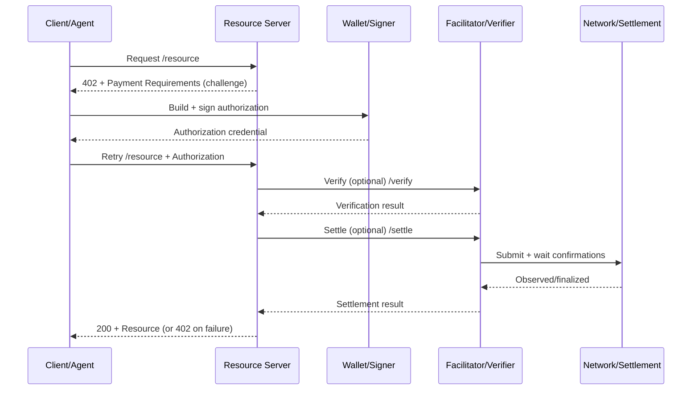

# x402 - Interaction Model

## Interaction Model

- **Client/Agent → Resource Server**: requests a resource
- **Resource Server → Client/Agent**: `402 Payment Required` plus payment requirements (challenge)
- **Client/Agent → Wallet/Signer**: builds and signs an authorization
- **Client/Agent → Resource Server**: retries the request with authorization attached
- **Resource Server → Verifier/Settlement**: verifies and settles (directly or via a facilitator)
- **Resource Server → Client/Agent**: `200` plus resource, and optional receipt metadata

## Header Wire Format (x402 V2)

In V2, payment communication is standardized via three Base64-encoded JSON headers:

- **`PAYMENT-REQUIRED`** (Server → Client): `PaymentRequired` (requirements, accepts, extensions)
- **`PAYMENT-SIGNATURE`** (Client → Server): `PaymentPayload` (authorization and payment payload)
- **`PAYMENT-RESPONSE`** (Server → Client): `SettlementResponse` (verify and settle outcome, success or failure)

## Mermaid (Sequence)

## Trust Boundaries (Condensed)

- **Client/Agent** is untrusted, all inputs must be verified.
- **Authorization credentials** must be bound to the resource, amount, recipient, network, and expiry.
- **Facilitator** simplifies verification and settlement, but is not a custodian. The server still needs a fulfillment policy.

## References (Official)

- x402 whitepaper core flow (402 → pay → retry): [x402 whitepaper PDF](https://www.x402.org/x402-whitepaper.pdf)
- Stripe x402 (lifecycle and integration): [Stripe x402 payments](https://docs.stripe.com/payments/machine/x402)
- Facilitator flow: [x402 Facilitator](https://docs.x402.org/core-concepts/facilitator)
- HTTP 402 and V2 headers: [x402 HTTP 402](https://docs.x402.org/core-concepts/http-402)
