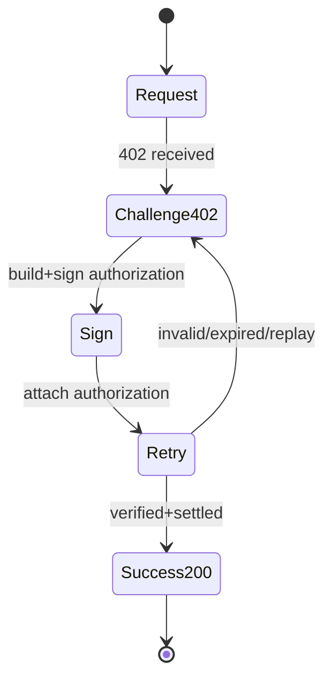

# x402 - Minimal Flow

## Working Definition (Acceptance Criteria)

An implementation should be considered correct only if:

- **No credentials** - always returns `402` with a consistent challenge
- **Valid credentials** - returns `200` plus the resource
- **Invalid credentials** (signature mismatch or field mismatch) - rejected (`402/4xx`)
- **Expired credentials** - rejected
- **Replay credentials** - rejected

## Minimum Server State

- **Nonce / paymentId store** - prevents replay and duplicate settlement
- **Expiry policy** - rejects credentials after `expiresAt`
- **Idempotency key** - maps fulfillment to a single settlement or authorization

## Idempotency Extension (Payment-Identifier)

x402 provides the **payment-identifier** extension for idempotency:

- The client sends a unique payment ID for a logical request
- The server caches responses keyed by payment ID (TTL), retries do not reprocess payment

## Minimum Client State

- **Wallet/Signer** - can sign authorizations for the chosen mechanism
- **Retry handler** - automatically retries requests with credentials
- **Policy** (optional but critical for agents) - spend limits, host allowlists, rate limits

## Mermaid (State Machine)

## References (Official)

- Whitepaper core payment flow: [x402 whitepaper PDF](https://www.x402.org/x402-whitepaper.pdf)
- Stripe x402 testing flow: [Stripe x402 payments](https://docs.stripe.com/payments/machine/x402)
- Payment-Identifier extension: [x402 Payment-Identifier](https://docs.x402.org/extensions/payment-identifier)
