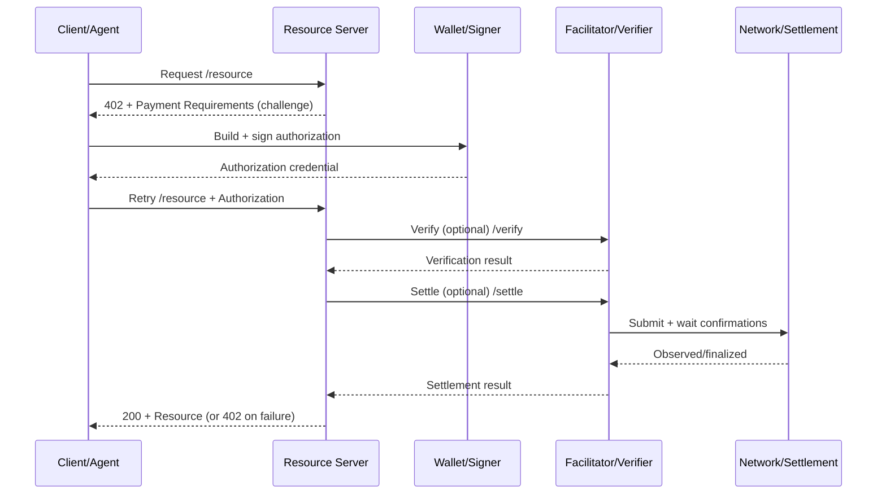

# x402 - Interaction Model

## Model Interaksi

- **Client/Agent → Resource server**: meminta resource
- **Resource server → Client/Agent**: `402 Payment Required` + payment requirements (challenge)
- **Client/Agent → Wallet/Signer**: membentuk dan menandatangani authorization
- **Client/Agent → Resource server**: retry request + authorization
- **Resource server → Verifier/Settlement**: verifikasi & settlement (langsung atau via facilitator)
- **Resource server → Client/Agent**: `200` + resource (dan metadata/receipt bila tersedia)

## Header Wire Format (x402 V2)

Pada V2, komunikasi pembayaran distandarkan lewat 3 header Base64-encoded JSON:

- **`PAYMENT-REQUIRED`** (Server → Client): `PaymentRequired` (requirements + accepts + extensions)
- **`PAYMENT-SIGNATURE`** (Client → Server): `PaymentPayload` (authorization/payload pembayaran)
- **`PAYMENT-RESPONSE`** (Server → Client): `SettlementResponse` (hasil verify/settle, sukses/gagal)

## Mermaid (Sequence)

## Trust Boundaries (Ringkas)

- **Client/Agent** tidak dipercaya: semua input harus diverifikasi
- **Authorization credential** harus terikat pada resource + amount + recipient + network + expiry
- **Facilitator** membantu operasional (verifikasi/settlement) tapi bukan “custodian”, server tetap butuh kebijakan untuk fulfill resource

## Referensi (Official)

- x402 whitepaper (core flow 402 → pay → retry): [x402 whitepaper PDF](https://www.x402.org/x402-whitepaper.pdf)
- Stripe x402 (lifecycle + integrasi): [Stripe x402 payments](https://docs.stripe.com/payments/machine/x402)
- x402 facilitator flow: [x402 Facilitator](https://docs.x402.org/core-concepts/facilitator)
- HTTP 402 & V2 headers: [x402 HTTP 402](https://docs.x402.org/core-concepts/http-402)
