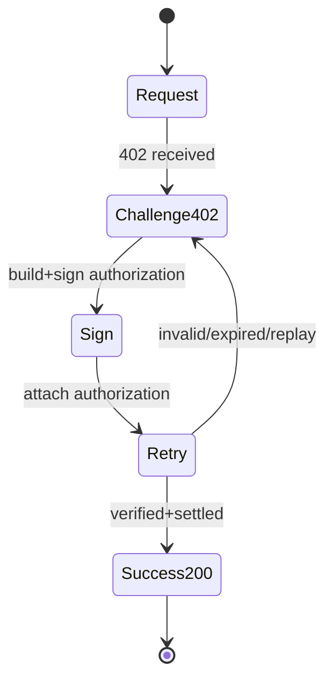

# x402 - Minimal Flow

## Definisi “Berfungsi” (Acceptance Criteria)

Implementasi dianggap benar hanya jika:

- **Tanpa kredensial** → selalu `402` dan challenge konsisten
- **Kredensial valid** → `200` + resource
- **Kredensial invalid** (signature mismatch / field mismatch) → ditolak (`402/4xx`)
- **Kredensial expired** → ditolak
- **Kredensial replay** → ditolak (anti-reuse)

## Minimum State Yang Dibutuhkan Server

- **Nonce / paymentId store**: untuk mencegah replay dan duplicate settlement
- **Expiry policy**: menolak credential setelah `expiresAt`
- **Idempotency key**: memetakan “fulfillment” ke satu settlement/authorization

## Idempotency Extension (Payment-Identifier)

Dokumentasi x402 menyediakan extension **payment-identifier** untuk idempotency:

- Client mengirim payment ID unik untuk “logical request”
- Server meng-cache response berdasarkan payment ID (TTL) sehingga retry tidak memproses pembayaran ulang

## Minimal State Yang Dibutuhkan Client

- **Wallet/Signer**: mampu sign authorization sesuai skema
- **Retry handler**: otomatis retry request dengan credential
- **Policy** (opsional tapi krusial untuk agent): limit amount, allowlist host, rate limit

## Mermaid (State Machine Ringkas)

## Referensi (Official)

- Whitepaper core payment flow: [x402 whitepaper PDF](https://www.x402.org/x402-whitepaper.pdf)
- Stripe x402: contoh endpoint + testing `curl` dan flow 402: [Stripe x402 payments](https://docs.stripe.com/payments/machine/x402)
- Payment-Identifier extension (idempotency): [x402 Payment-Identifier](https://docs.x402.org/extensions/payment-identifier)
